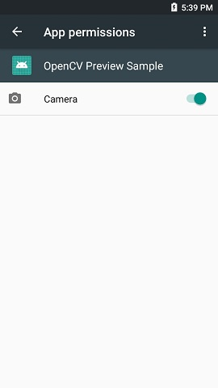
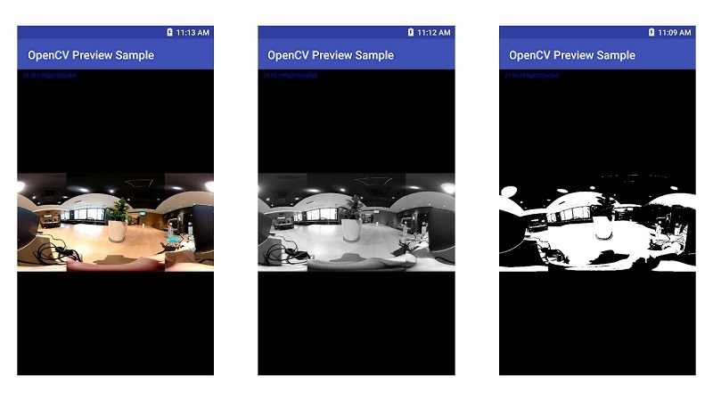

# OpenCV Preview Plug-in Sample for RICOH THETA

This sample plug-in gets the preview frames from RICOH THETA and does some image processing using by OpenCV library.


## Set up
* Download this project using git close.
```
$ git clone https://github.com/theta-skunkworks/theta-plugin-opencv-preview-sample
```
* Import this project by Android Studio.
* Build the plug-in and install to the THETA.
* Set up app permissions manually after the installation using by [Vysor](https://www.vysor.io/).<br>
Enable the permission of "Camera".<br>



### Attention
This plug-in gets frames and does image processing, but does not save it.<br>
To check the processed frame, please use [Vysor](https://www.vysor.io/) software.

The followings are the samples of the processed frame by this plug-in. These are captured using Vysor.<br>
( [Left] RGBA frame / [Middle] Grayscale frame / [Right] Processed frame (Binarization) )<br>



## Development Environment
### Camera
* RICOH THETA V Firmware ver.2.50.1 and above
* RICOH THETA Z1

### SDK/Library
* [RICOH THETA Plug-in SDK (ver.2.0.0)](https://github.com/ricohapi/theta-plugin-sdk)
* [OpenCV Android pack (ver.3.4.5)](https://opencv.org/releases.html)

### Development Software
* Android Studio ver.3.3+
* gradle ver.5.1.1


## License
```
Copyright 2018 Ricoh Company, Ltd.

Licensed under the Apache License, Version 2.0 (the "License");
you may not use this file except in compliance with the License.
You may obtain a copy of the License at

    http://www.apache.org/licenses/LICENSE-2.0

Unless required by applicable law or agreed to in writing, software
distributed under the License is distributed on an "AS IS" BASIS,
WITHOUT WARRANTIES OR CONDITIONS OF ANY KIND, either express or implied.
See the License for the specific language governing permissions and
limitations under the License.
```
